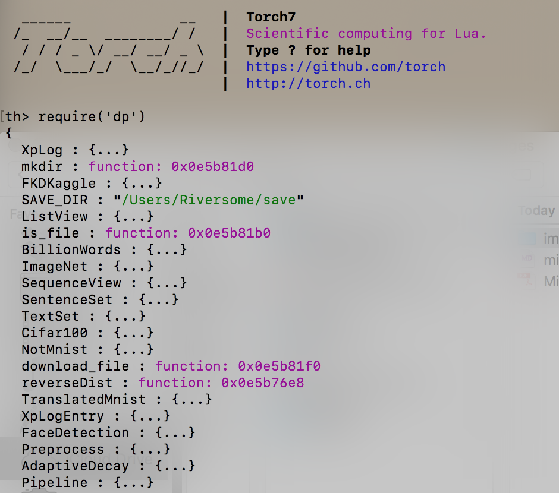
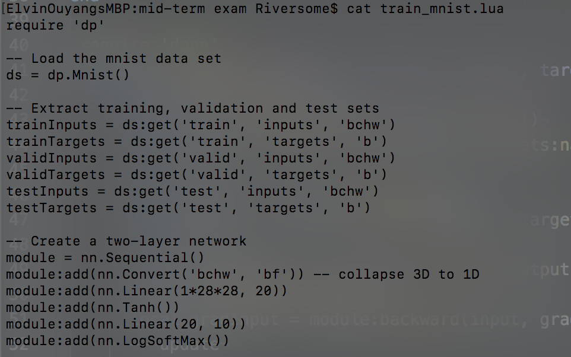
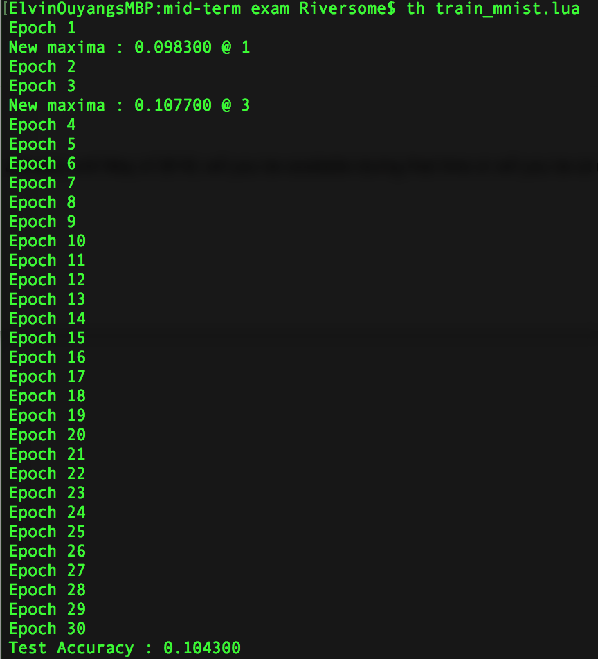
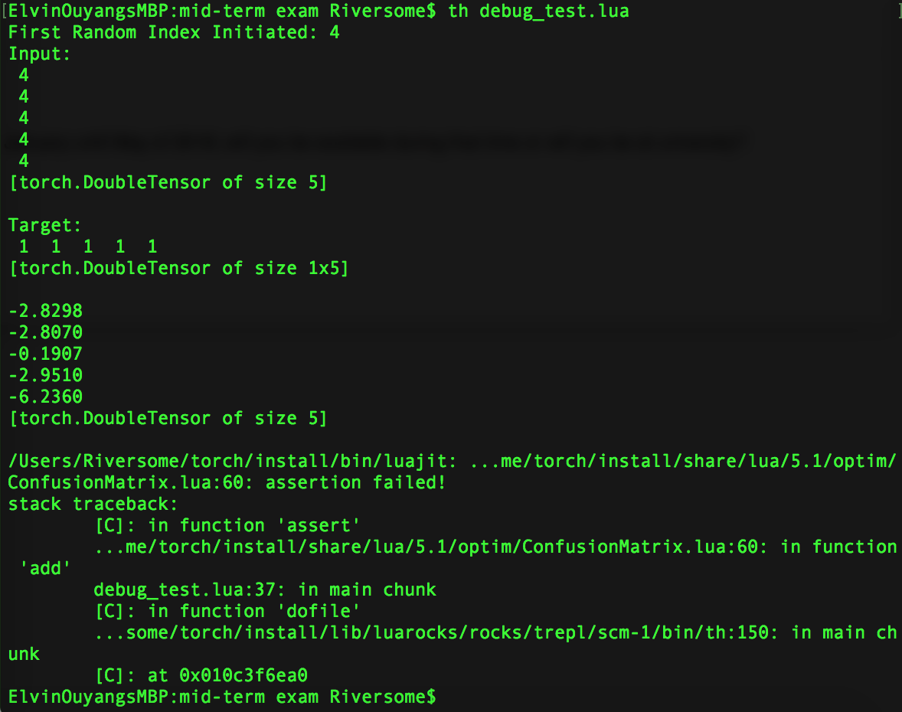
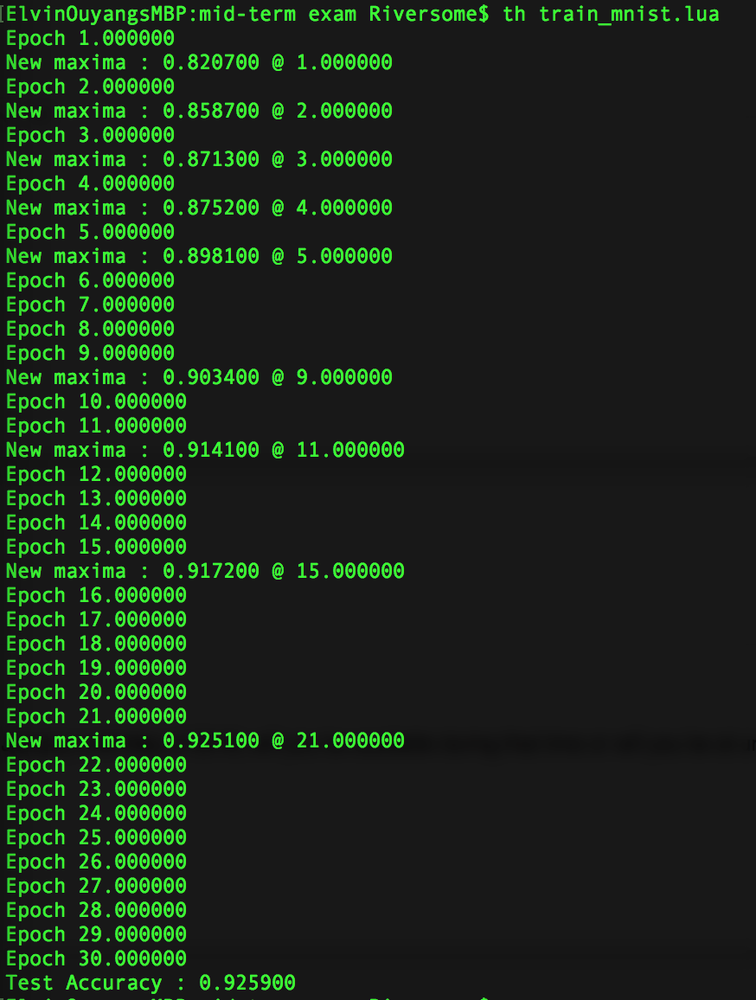

# Chuanye Ouyang - Deep Learning (Machine Learning II) Mid-term Results

**NOTE:** I have attached my LUA scripts at the end of this report as Appendix. In my answer to each question, I have quoted the relevant codes to each question.

## Q1.1. Check `lua`, `torch`, and `dp` are correctly installed on the machine.
Running `th` and then `require('dp')` displays the following screenshot in the terminal:



## Q1.2. Download file 'train_mnist.lua' for next steps
I have `git clone` the .lua file into my local directory for next steps:



## Q1.3. Debug the .lua file in IDE and identify problems before Running
The initial run of 'train_mnist.lua' file resulted in a stuck code and accuracy of below 10% and fail to improve in second and third epochs. Screenshot as below:



Due to the limited credit on GCP cloud and limited speed when connecting to GCP instance with ZBStudio, I will run and debug the codes in my own laptop for scripts that do not need GPU to run.

I took a close look at the codes, and the error seems to revolve around the shape of the matrix/vectors. So I created a new file 'debug_test.lua' with the core network training/updating codes as a streamline manner, as below:

```lua
require 'nn'
require 'optim'
require 'dpnn'
-- a quick simple network for testing
module = nn.Sequential()
module:add(nn.Linear(5, 5))
module:add(nn.LogSoftMax())
print(module)
-- this test also use the ClassNLLCriterion
criterion = nn.ClassNLLCriterion()
print(criterion)
-- I set the output length to be 5
cm = optim.ConfusionMatrix(5)
-- I created 5 entries of inputs
x = {1, 1, 1, 1, 1,
     2, 2, 2, 2, 2,
     3, 3, 3, 3, 3,
     4, 4, 4, 4, 4,
     5, 5, 5, 5, 5}
inputs = torch.Tensor(x):resize(5, 5)
print("Inputs:")
print(inputs)
-- I created 5 entries of targets (5 by 5 because each output has 5 elements)
y = {-1, -1 ,-1, -1, -1,
     -1, -1 ,-1, -1, -1,
     -1, -1 ,-1, -1, -1,
     1, 1, 1, 1, 1,
     1, 1, 1, 1, 1}
targets = torch.Tensor(y):resize(5, 5)
print("Outputs")
print(targets)
-- I then go through the core codes in streamline without loops
-- just for debugging
-- first test epoch
inx = math.random(1, inputs:size(1))
print(string.format("First Random Index Initiated: %i", inx))
input, target = inputs[inx], targets:narrow(1, inx, 1)
-- targets size is incorrect. should be 5 instead of 1 by 5
print("Selected Input:")
print(input)
print("Selected Target:")
print(target)

output = module:forward(input)
print("Module Output:")
print(output)
cm:add(output, target)
print("Module precision:")
print(cm.totalValid)

-- first module update
loss = criterion:forward(output, target)
gradOutput = criterion:backward(output, target)
module:zeroGradParameters()
gradInput = module:backward(input, gradOutput)
module:updateGradParameters(0.9)
module:updateParameters(0.1)

-- second test epoch
inx = math.random(1, inputs:size(1))
print(string.format("Second Random Index Initiated: %f", inx))
input, target = inputs[inx], targets:narrow(1, inx, 1) -- targets size is incorrect. should be 5 instead of 1 by 5
print("Selected Input:")
print(input)
print("Selected Target:")
print(target)
output = module:forward(input)
print("Module Output:")
print(output)
cm:add(output, target)
print("Module precision:")
print(cm.totalValid)
```

I immediately receive errors as below:



The core codes ran into an error for the `optim.ConfusionMatrix():add()` function. A closer look at the test code reflects that the size of "target" is not consistent of size of module output.

It seems that some wrappers used in 'train_mnist.lua' have suppressed error messages about the vector sizes. The target size from `targets:narrow(1, idx, 1)` is (1, 5) while the output size of the module is 5. Apparently the `:narrow(1, idx)` selector has transpose the vector and made it incomparable with module outputs. I then replaced the code with `targets[idx]` in both `classEval` and `trainEpoch` functions. The updated code yields the following results:



The network reached an accuracy of 92.51% for validation set and 92.9% for test set, pretty impressive! Below is my annotations to the train_mnist.lua file that helps me get through all the meanings of the steps.

```lua
require 'dp'
require 'nn'
require 'dpnn'
require 'optim'

-- Load the mnist data set
ds = dp.Mnist() --initiate MNIST downloader

-- Extract training, validation and test sets
trainInputs = ds:get('train', 'inputs', 'bchw') -- get train Inputs in bchw format(batch, color, heigth, weight)
trainTargets = ds:get('train', 'targets', 'b') --get train Targets in b format (batch)
validInputs = ds:get('valid', 'inputs', 'bchw') -- get validity Inputs in bchw
validTargets = ds:get('valid', 'targets', 'b') -- get validity Targets in b
testInputs = ds:get('test', 'inputs', 'bchw') -- get test Inputs in bchw
testTargets = ds:get('test', 'targets', 'b') -- get test Targets in b

-- Create a two-layer network
module = nn.Sequential() -- initiate a fully-connected feed forward network container
module:add(nn.Convert('bchw', 'bf')) -- dpnn function, collapse input from bchw to bf, a single vector for each input unit
module:add(nn.Linear(1*28*28, 20)) -- input the bf vector (with shape ds:featureSize()), net output of 20 element vector
module:add(nn.Tanh()) -- add Tahn() to input, normalize the net output to (-1, 1)
module:add(nn.Linear(20, 10)) -- add output layer that takes 20 inputs and spits 10 outputs
module:add(nn.LogSoftMax())  -- apply LogSoftMax function to feed the function for classification purpose (ClassNLLCriterion only takes the log of SoftMax)

-- Use the cross-entropy performance index
criterion = nn.ClassNLLCriterion() -- define criterion as ClassNLLCriterion, which takes in log probability of classes passed over by LogSoftMax

-- create performance evaluation function with optim:ConfusionMatrix
require 'optim'
-- allocate a confusion matrix
cm = optim.ConfusionMatrix(10) -- initiate ConfusionMatrix with NUMBER OF OUTPUTS from the model (10)
-- create a function to compute
function classEval(module, inputs, targets)
   cm:zero() -- reset values
   for idx=1,inputs:size(1) do -- iterate through each row of the inputs
      local input, target = inputs[idx], targets[idx] -- assign a row of input and correspoding target
      local output = module:forward(input) -- calculate predictions from module
      cm:add(output, target) -- update confusion matrix with module prediction and target
   end
   cm:updateValids()
   return cm.totalValid
end

-- define one epoch of calculation in a function (for cross-epoch test)
require 'dpnn'
function trainEpoch(module, criterion, inputs, targets)
   for i=1,inputs:size(1) do -- iterate through each row of the inputs
      local idx = math.random(1,inputs:size(1)) -- randomly select a row from inputs
      local input, target = inputs[idx], targets[idx] -- assign inputs and targets with idx
      -- forward
      local output = module:forward(input) -- calculate module output
      local loss = criterion:forward(output, target) -- calculate module error
      -- backward
      local gradOutput = criterion:backward(output, target) -- calculate module sensitivity
      module:zeroGradParameters()
      local gradInput = module:backward(input, gradOutput) -- calculate module weight updates
      -- update
      module:updateGradParameters(0.9) -- momentum (dpnn) of 0.9 defined to avoid local minimums
      module:updateParameters(0.1) -- W = W - 0.1*dL/dW learning rate of 0.1
   end
end

bestAccuracy, bestEpoch = 0, 0 -- initiate calculator for best accuracy and epoch
wait = 0 -- initiate counter for number of epochs where the current best epoch beats a new epoch
for epoch=1,30 do -- iterate the epoch 30 times
   print(string.format("Epoch %i", epoch))
   trainEpoch(module, criterion, trainInputs, trainTargets) -- go through an epoch
   local validAccuracy = classEval(module, validInputs, validTargets) -- calculate accuracy (totalValid from optim.ConfusionMatrix)
   if validAccuracy > bestAccuracy then -- record better accuracy/epoch of current epoch compared to previous epoch
      bestAccuracy, bestEpoch = validAccuracy, epoch
      --torch.save("/path/to/saved/model.t7", module)
      print(string.format("New maxima : %f @ %i", bestAccuracy, bestEpoch)) -- print the updated accuracy/epoch
      wait = 0 -- reset wait counter since bestAccuracy and bestEpoch are updated
   else
      wait = wait + 1 -- if the older accuracy/epoch is better, increase the counter by 1
      if wait > 30 then break end -- if wait if larger than 30, it means the model has reached the bestAccuracy 30 epoches earlier, a global minimum is likely reached; break the loop
   end
end
testAccuracy = classEval(module, testInputs, testTargets) -- use the trained module on test data
print(string.format("Test Accuracy : %f ", testAccuracy)) -- report the test accuracy
```

## Q1.4. Modify the code to run on GPU
I first modified the code to have it work on Google GCP Instance by moving all the training data over to the GPU. The modified code chunks are as below:
```lua
require 'cunn'
require 'cutorch'

trainInputs = ds:get('train', 'inputs', 'bchw'):cuda()
trainTargets = ds:get('train', 'targets', 'b'):cuda()
validInputs = ds:get('valid', 'inputs', 'bchw')
validTargets = ds:get('valid', 'targets', 'b')
testInputs = ds:get('test', 'inputs', 'bchw')
testTargets = ds:get('test', 'targets', 'b')

module = nn.Sequential()
module:add(nn.Convert('bchw', 'bf'))
module:add(nn.Linear(1*28*28, 20))
module:add(nn.Tanh())
module:add(nn.Linear(20, 10))
module:add(nn.LogSoftMax())
module = module:cuda()

criterion = nn.ClassNLLCriterion():cuda()
```
The `cutorth` and `cunn` packages make it easy to use GPUs. By calling `:cuda()` method on Tensors and modules (either network or criterion), the result is moved over to GPU for calculation. However, since all the data is stored in GPUs, the calculation speed is actually slower than when I use it in my own laptop. Therefore, I tried to adjust the code so that only a portion of the data is passed over to GPUs for computing. I ended up with bringing CudaTensors only in the functions, as shown below:
```lua
-- module initiated
module = module:cuda()

criterion = nn.ClassNLLCriterion():cuda()

-- allocate a confusion matrix
cm = optim.ConfusionMatrix(10)
function classEval(module, inputs, targets)
   local inputs = inputs:cuda()
   local targets = targets:cuda()
   for idx=1, inputs:size(1) do
      local input, target = inputs[idx], targets[idx]
      local output = module:forward(input)
      cm:add(output, target)
   end
   cm:updateValids()
   return cm.totalValid
end

function trainEpoch(module, criterion, inputs, targets)
   local inputs = inputs:cuda()
   local targets = targets:cuda()
   for i=1, inputs:size(1) do
      local idx = math.random(1,inputs:size(1))
      local input, target = inputs[idx], targets[idx]
      -- forward
      local output = module:forward(input)
      local loss = criterion:forward(output, target)
      -- backward
      local gradOutput = criterion:backward(output, target)
      module:zeroGradParameters()
      local gradInput = module:backward(input, gradOutput)
      -- update
      module:updateGradParameters(0.9)
      module:updateParameters(0.1)
   end
end
```
After I've adjusted when I move the data over to GPUs, the time spent to train the model is significantly reduced (although this still will certainly be slower than mini-batch solutions). I will implement the mini-batch solutions in next question.

## Q1.5. Adjust the code to have it run on mini-batches and compare different mini-batch sizes

I was able to successfully create mini-batches from the data and feed to the optim.sgd function for optimization. My mini-batch program running with CPU is as below (only showing the scripts that's different from previous codes):
```lua
torch.manualSeed(1122)

-- updated trainEpoch function to randomly extract mini-batches in each Epoch
function trainEpoch(module, criterion, inputs, targets, batch_size)
    local idxs = torch.randperm(inputs:size(1)) -- create a random list for indexing
    for i=1, inputs:size(1), batch_size do
        if i + batch_size > inputs:size(1) then
            idx = idxs:narrow(1, i, inputs:size(1) - i)
        else
            idx = idxs:narrow(1, i, batch_size)
        end
        local batchInputs = inputs:index(1, idx:long())
        local batchLabels = targets:index(1, idx:long())
        local params, gradParams = module:getParameters()
        local optimState = {learningRate = 0.1, momentum = 0.9}
        function feval(params)
            gradParams: zero()
            local outputs = module:forward(batchInputs)
            local loss = criterion:forward(outputs, batchLabels)
            local dloss_doutputs = criterion:backward(outputs, batchLabels)
            module:backward(batchInputs, dloss_doutputs)
            return loss, gradParams
        end
        optim.sgd(feval, params, optimState)
    end
    idx = nil
end

-- updated main training code
batch_size = 100
cputime0 = sys.clock()

for epoch=1, 30 do
   print(string.format("Epoch %i", epoch))
   trainEpoch(module, criterion, trainInputs, trainTargets, batch_size)
   local validAccuracy = classEval(module, validInputs, validTargets)
   if validAccuracy > bestAccuracy then
      bestAccuracy, bestEpoch = validAccuracy, epoch
      print(string.format("New maxima : %f @ %i", bestAccuracy, bestEpoch))
      wait = 0
   else
      wait = wait + 1
      if wait > 30 then break end
   end
end

cputime1 = sys.clock()
cputime = cputime1 - cputime0
print(string.format("Training took CPU %f ms", cputime * 1000))
```
With a determined random seed, a timer and the parameters for batch_size now available in the codes, I tested out different batch_sizes and their corresponding training time, validity, and test accuracy, as below:

|training type | running time | validity | test accuracy|
|--------------|--------------|----------|--------------|
|stochastic + CPU | 581,958.50 ms | 0.924400 @ 21 | 0.916100|
|mini-batch 50 + CPU | 105,053.89 ms | 0.947500 @ 30 | 0.947761|
|mini-batch 100 + CPU | 72,429.04 ms | 0.943427 @ 30 | 0.943842|
|mini-batch 200 + CPU | 62103.65 ms | 0.935730 @ 30 | 0.936219|
|mini-batch 250 + CPU | 47021.47 ms | 0.932083 @ 30 | 0.932632|
|mini-batch 300 + CPU | 43706.69 ms | 0.929040 @ 30 | 0.929613|
|mini-batch 350 + CPU | 42216.22 ms | 0.926347 @ 30 | 0.926961|
|mini-batch 400 + CPU | 42010.60 ms | 0.923987 @ 30 | 0.924626|
|mini-batch 450 + CPU | 41039.43 ms | 0.920610 @ 30 | 0.921326|
|mini-batch 500 + CPU | 40659.03 ms | 0.919363 @ 30 | 0.920065|
|mini-batch 550 + CPU | 39870.70 ms | 0.917253 @ 30 | 0.917990|

The above form indicates that at mini-batch size of 250, the training time is significantly reduced, while both the validation accuracy and testing accuracy do not suffer too much of a loss. I will stick with a mini-batch size of 250 in following questions.

**Note: I have attempted to feed the mini-batches to GPUs on GCP instance but received errors about input data shape when the first epoch is finished. Having debugging the codes for couple hours, I still cannot identify the hidden culprit that is preventing GPUs to calculate in second epoch. I have included my codes for gpu mini-batches in the attached appendix.**

## Q1.6. Increase number of layers while maintaining total number of weight and biases, describe the findings on training time and performance
In order to compare the impacts of the network, I have created several models and compare their performance. The models are as below:
```lua
print('Module 1 initiated:')
module = nn.Sequential()
module:add(nn.Convert('bchw', 'bf'))
module:add(nn.Linear(1*28*28, 20))
module:add(nn.Tanh())
module:add(nn.Linear(20, 10))
module:add(nn.LogSoftMax())
params, gradParams = module:getParameters()
module_length = params:size(1)
print(string.format('Module 1 has %i total weight and biases', module_length))
-- 15910

print('Module 2 initiated:')
module = nn.Sequential()
module:add(nn.Convert('bchw', 'bf'))
module:add(nn.Linear(1*28*28, 20))
module:add(nn.Tanh())
module:add(nn.Linear(20, 5))
module:add(nn.Tanh())
module:add(nn.Linear(5, 10))
module:add(nn.LogSoftMax())
params, gradParams = module:getParameters()
module_length = params:size(1)
print(string.format('Module 2 has %i total weight and biases', module_length))
-- 15865

print('Module 3 initiated:')
module = nn.Sequential()
module:add(nn.Convert('bchw', 'bf'))
module:add(nn.Linear(1*28*28, 20))
module:add(nn.Tanh())
module:add(nn.Linear(20, 5))
module:add(nn.Tanh())
module:add(nn.Linear(5, 5))
module:add(nn.Tanh())
module:add(nn.Linear(5, 10))
module:add(nn.LogSoftMax())
params, gradParams = module:getParameters()
module_length = params:size(1)
print(string.format('Module 3 has %i total weight and biases', module_length))
-- 15895

print('Module 4 initiated:')
module = nn.Sequential()
module:add(nn.Convert('bchw', 'bf'))
module:add(nn.Linear(1*28*28, 15))
module:add(nn.Tanh())
module:add(nn.Linear(15, 150))
module:add(nn.Tanh())
module:add(nn.Linear(150, 10))
module:add(nn.LogSoftMax())
params, gradParams = module:getParameters()
module_length = params:size(1)
print(string.format('Module 4 has %i total weight and biases', module_length))
-- 15685

print('Module 5 initiated:')
module = nn.Sequential()
module:add(nn.Convert('bchw', 'bf'))
module:add(nn.Linear(1*28*28, 15))
module:add(nn.Tanh())
module:add(nn.Linear(15, 100))
module:add(nn.Tanh())
module:add(nn.Linear(100, 20))
module:add(nn.Tanh())
module:add(nn.Linear(20, 10))
module:add(nn.LogSoftMax())
params, gradParams = module:getParameters()
module_length = params:size(1)
print(string.format('Module 5 has %i total weight and biases', module_length))
-- 15605

print('Module 6 initiated:')
module = nn.Sequential()
module:add(nn.Convert('bchw', 'bf'))
module:add(nn.Linear(1*28*28, 15))
module:add(nn.Tanh())
module:add(nn.Linear(15, 75))
module:add(nn.Tanh())
module:add(nn.Linear(75, 30))
module:add(nn.Tanh())
module:add(nn.Linear(30, 10))
module:add(nn.Tanh())
module:add(nn.Linear(10, 10))
module:add(nn.LogSoftMax())
params, gradParams = module:getParameters()
module_length = params:size(1)
print(string.format('Module 5 has %i total weight and biases', module_length))
-- 15675
```
I have adjusted the models so that the total count of weight and biases are close to each other. Below are the run results:

|model|model layers | running time | validity | test accuracy |
|-----|-------------|--------------|----------|---------------|
|Model 1 (initial)| 2 | 60872.09 ms | 0.932083 @ 30 | 0.932632|
|Model 2 | 3 | 52603.30 ms | 0.919883 @ 30 | 0.920739|
|Model 3 | 4 | 62065.40 ms | 0.911817 @ 30 | 0.912710|
|Model 4 | 3 | 66967.48 ms | 0.937330 @ 30 | 0.937723|
|Model 5 | 4 | 64364.42 ms | 0.940903 @ 30 | 0.941339|
|Model 6 | 5 | 70918.89 ms | 0.927510 @ 30 | 0.928203|

The above results indicates that with a same total level of weights and biases, networks with more layers will take more time to compute (compare Model 1 with the rest of the models). At the mean time, the precision and validity of the model might not have much of a performance boost with a more complex network.

## Q1.7. try another optimization algorithm from the optim package and compare with gradient descent
Since I'd like to utilize the momentum parameter defined in the model, I will try the `optim.nag()` algorithm, i.e. *Nesterov's Accelerated Gradient* in the model. I simply replace the `optim.sgd()` function with the new function. The result is as below:

|Optim Algorithm| running time | validity | test accuracy |
|---------------|--------------|----------|---------------|
|optim.sgd()| 60872.09 ms | 0.932083 @ 30 | 0.932632|
|optim.nag()| 58659.67 ms | 0.932083 @ 30 | 0.932632|

The new model takes a little less time and achieved the exact same level of performance, provided that the two runs have the same random seed initiated.

## Q1.8. try different transfer functions and do a comparison study between them
I have gone through the listed transfer functions in the `nn` package and decided to compare the time cost and performance of the following functions with the initial `nn.Tanh()` function:
`nn.SoftSign()`, `nn.LogSigmoid()`, and `nn.Sigmoid()`. These activation functions do not need a user defined threshold and make a continuous output in its transformation. I will also use `nn.HardTanh()` as a benchmark comparison, since this function will eliminate much of the variance in the input data; I hope to see what impact (probably negative ones) would activation functions like this bring to the final output.
Below are my results:

|Hidden Layer Transfer Function| running time | validity | test accuracy |
|---------------|--------------|----------|---------------|
|nn.Tanh()| 60872.09 ms | 0.932083 @ 30 | 0.932632|
|nn.HardTanh()| 55920.45 ms | 0.934703 @ 30 | 0.935213|
|nn.SoftSign()| 55247.28 ms | 0.922253 @ 30 | 0.922829|
|nn.LogSigmoid()| 55269.34 ms | 0.927663 @ 30 | 0.928294|
|nn.Sigmoid()| 73596.76 ms | 0.895133 @ 30 | 0.896358|

From the above chart I can infer that `nn.Sigmoid()` is the least suitable for the problem, probably because its returned output is not symmetric (since it rescaled the values to (0, 1)). Other transfer functions seem to have close time cost and performance.

## Q1.9. Compare time and performance of the same model with mini-batch, full batch, and stochastic approaches
The full batch training can be achieved by assigning batch_size as size of the whole data. The resulted comparison is as below:

|feed approach| running time | validity | test accuracy |
|---------------|--------------|----------|---------------|
|mini-batch| 46,285.09 ms | 0.932083 @ 30 | 0.932632|
|full-batch| 40,636.04 ms | 0.559963 @ 30 | 0.565010|
|stochastic| 571,905.13 ms | 0.916600 @ 28 | 0.903700|

It appears that even though the full-batch approach is faster than mini-batch approach, its validity and precision is significantly lower than that of a mini-batch approach. The reduction in model quality is caused by the lack of actual epochs going through the `optim` function: with mini-batch, each epoch has tens of weight/bias update while with full batch each epoch has only one update.

The stochastic approach, on the other hand, achieved similar level of performance at the cost of running time: this is due to the fact that time is wasted in the latency waiting time when the program is transferring one line of data from the input data storage to the processor. In conclusion, the mini-batch feed approach is the optimized way to train this specific network, since it makes full use of the processing power without wasting time on data transfer between memory and processors.

## APPENDIX
### train_mnist.lua
```lua
require 'dp'
require 'nn'
require 'dpnn'
require 'optim'

torch.manualSeed(1122)

-- Load the mnist data set
ds = dp.Mnist() --initiate MNIST downloader

-- Extract training, validation and test sets
trainInputs = ds:get('train', 'inputs', 'bchw') -- get train Inputs in bchw format(batch, color, heigth, weight)
trainTargets = ds:get('train', 'targets', 'b') --get train Targets in b format (batch)
validInputs = ds:get('valid', 'inputs', 'bchw') -- get validity Inputs in bchw
validTargets = ds:get('valid', 'targets', 'b') -- get validity Targets in b
testInputs = ds:get('test', 'inputs', 'bchw') -- get test Inputs in bchw
testTargets = ds:get('test', 'targets', 'b') -- get test Targets in b

-- Create a two-layer network
module = nn.Sequential() -- initiate a fully-connected feed forward network container
module:add(nn.Convert('bchw', 'bf')) -- dpnn function, collapse input from bchw to bf, a single vector for each input unit
module:add(nn.Linear(1*28*28, 20)) -- input the bf vector (with shape ds:featureSize()), net output of 20 element vector
module:add(nn.Tanh()) -- add Tahn() to input, normalize the net output to (-1, 1)
module:add(nn.Linear(20, 10)) -- add output layer that takes 20 inputs and spits 10 outputs
module:add(nn.LogSoftMax())  -- apply LogSoftMax function to feed the function for classification purpose (ClassNLLCriterion only takes the log of SoftMax)

-- Use the cross-entropy performance index
criterion = nn.ClassNLLCriterion() -- define criterion as ClassNLLCriterion, which takes in log probability of classes passed over by LogSoftMax

-- create performance evaluation function with optim:ConfusionMatrix
require 'optim'
-- allocate a confusion matrix
cm = optim.ConfusionMatrix(10) -- initiate ConfusionMatrix with NUMBER OF OUTPUTS from the model (10)
-- create a function to compute
function classEval(module, inputs, targets)
   cm:zero() -- reset values
   for idx=1,inputs:size(1) do -- iterate through each row of the inputs
      local input, target = inputs[idx], targets[idx] -- assign a row of input and correspoding output; targets should be a vector, so resize with width of targets
      local output = module:forward(input) -- calculate predictions from module
      cm:add(output, target) -- update confusion matrix with module prediction and target
   end
   cm:updateValids()
   return cm.totalValid
end

-- define one epoch of calculation in a function (for cross-epoch test)
require 'dpnn'
function trainEpoch(module, criterion, inputs, targets)
   for i=1,inputs:size(1) do -- iterate through each row of the inputs
      local idx = math.random(1,inputs:size(1)) -- randomly select a row from inputs
      local input, target = inputs[idx], targets[idx] -- assign inputs and targets with idx, targets should be a vector, so resize with width of targets
      -- forward
      local output = module:forward(input) -- calculate module output
      local loss = criterion:forward(output, target) -- calculate module error
      -- backward
      local gradOutput = criterion:backward(output, target) -- calculate module sensitivity
      module:zeroGradParameters()
      local gradInput = module:backward(input, gradOutput) -- calculate module weight updates
      -- update
      module:updateGradParameters(0.9) -- momentum (dpnn) of 0.9 defined to avoid local minimums
      module:updateParameters(0.1) -- W = W - 0.1*dL/dW learning rate of 0.1
   end
end

bestAccuracy, bestEpoch = 0, 0 -- initiate calculator for best accuracy and epoch
wait = 0 -- initiate counter for number of epochs where the current best epoch beats a new epoch

cputime0 = sys.clock()

for epoch=1,30 do -- iterate the epoch 30 times
   print(string.format("Epoch %i", epoch))
   trainEpoch(module, criterion, trainInputs, trainTargets) -- go through an epoch
   local validAccuracy = classEval(module, validInputs, validTargets) -- calculate accuracy (totalValid from optim.ConfusionMatrix)
   if validAccuracy > bestAccuracy then -- record better accuracy/epoch of current epoch compared to previous epoch
      bestAccuracy, bestEpoch = validAccuracy, epoch
      --torch.save("/path/to/saved/model.t7", module)
      print(string.format("New maxima : %f @ %i", bestAccuracy, bestEpoch)) -- print the updated accuracy/epoch
      wait = 0 -- reset wait counter since bestAccuracy and bestEpoch are updated
   else
      wait = wait + 1 -- if the older accuracy/epoch is better, increase the counter by 1
      if wait > 30 then break end -- if wait if larger than 30, it means the model has reached the bestAccuracy 30 epoches earlier, a global minimum is likely reached; break the loop
   end
end

cputime1 = sys.clock()
cputime = cputime1 - cputime0
print(string.format("Training took CPU %f ms", cputime * 1000))
testAccuracy = classEval(module, testInputs, testTargets) -- use the trained module on test data
print(string.format("Test Accuracy : %f ", testAccuracy)) -- report the test accuracy
```

### train_mnist_gpu.lua
```lua
require 'dp'
require 'nn'
require 'dpnn'
require 'optim'
require 'cunn'
require 'cutorch'

torch.manualSeed(1122)

-- Load the mnist data set
ds = dp.Mnist()

-- Extract training, validation and test sets
trainInputs = ds:get('train', 'inputs', 'bchw')
trainTargets = ds:get('train', 'targets', 'b')
validInputs = ds:get('valid', 'inputs', 'bchw')
validTargets = ds:get('valid', 'targets', 'b')
testInputs = ds:get('test', 'inputs', 'bchw')
testTargets = ds:get('test', 'targets', 'b')

-- Create a two-layer network
print('Module initiated:')
module = nn.Sequential()
module:add(nn.Convert('bchw', 'bf'))
module:add(nn.Linear(1*28*28, 20))
module:add(nn.Tanh())
module:add(nn.Linear(20, 10))
module:add(nn.LogSoftMax())
module = module:cuda()
print(module)

-- Use the cross-entropy performance index
print('Criterion initiated:')
criterion = nn.ClassNLLCriterion():cuda()

-- create performance evaluation function with optim:ConfusionMatrix
require 'optim'
-- allocate a confusion matrix
cm = optim.ConfusionMatrix(10)

-- create a function to compute
function classEval(module, inputs, targets)
   local inputs = inputs:cuda()
   local targets = targets:cuda()
   for idx=1, inputs:size(1) do
      local input, target = inputs[idx], targets[idx]
      local output = module:forward(input)
      cm:add(output, target)
   end
   cm:updateValids()
   return cm.totalValid
end

-- define one epoch of calculation in a function (for cross-epoch test)
require 'dpnn'
function trainEpoch(module, criterion, inputs, targets)
   local inputs = inputs:cuda()
   local targets = targets:cuda()
   for i=1, inputs:size(1) do
      local idx = math.random(1,inputs:size(1))
      local input, target = inputs[idx], targets[idx]
      -- forward
      local output = module:forward(input)
      local loss = criterion:forward(output, target)
      -- backward
      local gradOutput = criterion:backward(output, target)
      module:zeroGradParameters()
      local gradInput = module:backward(input, gradOutput)
      -- update
      module:updateGradParameters(0.9)
      module:updateParameters(0.1)
   end
end

bestAccuracy, bestEpoch = 0, 0
wait = 0

for epoch=1,30 do
   print(string.format("Epoch %i", epoch))
   trainEpoch(module, criterion, trainInputs, trainTargets)
   local validAccuracy = classEval(module, validInputs, validTargets)
   if validAccuracy > bestAccuracy then
      bestAccuracy, bestEpoch = validAccuracy, epoch
      print(string.format("New maxima : %f @ %i", bestAccuracy, bestEpoch))
      wait = 0
   else
      wait = wait + 1
      if wait > 30 then break end
   end
end
testAccuracy = classEval(module, testInputs, testTargets)
print(string.format("Test Accuracy : %f ", testAccuracy))
```

### train_mnist_mini_batches.lua
```lua
require 'dp'
require 'nn'
require 'dpnn'
require 'optim'
require 'cunn'
require 'cutorch'

torch.manualSeed(1122)

-- Load the mnist data set
ds = dp.Mnist()

-- Extract training, validation and test sets
trainInputs = ds:get('train', 'inputs', 'bchw')
trainTargets = ds:get('train', 'targets', 'b')
validInputs = ds:get('valid', 'inputs', 'bchw')
validTargets = ds:get('valid', 'targets', 'b')
testInputs = ds:get('test', 'inputs', 'bchw')
testTargets = ds:get('test', 'targets', 'b')

-- Create a two-layer network
print('Module initiated:')
module = nn.Sequential()
module:add(nn.Convert('bchw', 'bf'))
module:add(nn.Linear(1*28*28, 20))
module:add(nn.Tanh())
module:add(nn.Linear(20, 10))
module:add(nn.LogSoftMax())
module = module:cuda()
print(module)

-- Use the cross-entropy performance index
print('Criterion initiated:')
criterion = nn.ClassNLLCriterion():cuda()
print(criterion)

print('ConfusionMatrix Initiated:')
cm = optim.ConfusionMatrix(10)
print(cm)


function trainEpoch(module, criterion, inputs, targets, batch_size)
    local idxs = torch.randperm(inputs:size(1)) -- create a random list for indexing
    local inputs = inputs:cuda()
    local targets = targets:cuda()
    for i=1, inputs:size(1), batch_size do
        if i + batch_size > inputs:size(1) then
            idx = idxs:narrow(1, i, inputs:size(1) - i)
        else
            idx = idxs:narrow(1, i, batch_size)
        end
        local batchInputs = inputs:index(1, idx:long())
        local batchLabels = targets:index(1, idx:long())
        local params, gradParams = module:getParameters()
        local optimState = {learningRate = 0.1, momentum = 0.9}
        function feval(params)
            gradParams: zero()
            local outputs = module:forward(batchInputs)
            local loss = criterion:forward(outputs, batchLabels)
            local dloss_doutputs = criterion:backward(outputs, batchLabels)
            module:backward(batchInputs, dloss_doutputs)
            return loss, gradParams
        end
        optim.sgd(feval, params, optimState)
    end
end


function classEval(module, inputs, targets)
   for idx_c=1, inputs:size(1) do
      local input, target = inputs[idx_c], targets[idx_c]
      local output = module:forward(input)
      cm:add(output, target)
   end
   cm:updateValids()
   return cm.totalValid
end

bestAccuracy, bestEpoch = 0, 0
wait = 0
batch_size = 100

for epoch=1, 30 do
   print(string.format(">>> Epoch %i, start training...", epoch))
   trainEpoch(module, criterion, trainInputs, trainTargets, batch_size)
   print(string.format('>>> Epoch %i trained, now validating...', epoch))
   local validAccuracy = classEval(module, validInputs, validTargets)
   if validAccuracy > bestAccuracy then
      bestAccuracy, bestEpoch = validAccuracy, epoch
      print(string.format("New maxima : %f @ %i", bestAccuracy, bestEpoch))
      wait = 0
   else
      wait = wait + 1
      if wait > 30 then break end
   end
end

print(cm)
testAccuracy = classEval(module, testInputs, testTargets)
print(string.format("Test Accuracy : %f ", testAccuracy))
```

## train_mnist_gpu_mini_batches.lua
```lua
require 'dp'
require 'nn'
require 'dpnn'
require 'optim'
require 'cunn'
require 'cutorch'

torch.manualSeed(1122)

-- Load the mnist data set
ds = dp.Mnist()

-- Extract training, validation and test sets
trainInputs = ds:get('train', 'inputs', 'bchw')
trainTargets = ds:get('train', 'targets', 'b')
validInputs = ds:get('valid', 'inputs', 'bchw')
validTargets = ds:get('valid', 'targets', 'b')
testInputs = ds:get('test', 'inputs', 'bchw')
testTargets = ds:get('test', 'targets', 'b')

-- Create a two-layer network
print('Module initiated:')
module = nn.Sequential()
module:add(nn.Convert('bchw', 'bf'))
module:add(nn.Linear(1*28*28, 20))
module:add(nn.Tanh())
module:add(nn.Linear(20, 10))
module:add(nn.LogSoftMax())
module = module:cuda()
print(module)

-- Use the cross-entropy performance index
print('Criterion initiated:')
criterion = nn.ClassNLLCriterion():cuda()
print(criterion)

print('ConfusionMatrix Initiated:')
cm = optim.ConfusionMatrix(10)
print(cm)


function trainEpoch(module, criterion, inputs, targets, batch_size)
    local idxs = torch.randperm(inputs:size(1)) -- create a random list for indexing
    local inputs = inputs
    local targets = targets
    for i=1, inputs:size(1), batch_size do
        if i + batch_size > inputs:size(1) then
            idx = idxs:narrow(1, i, inputs:size(1) - i)
        else
            idx = idxs:narrow(1, i, batch_size)
        end
        local batchInputs = inputs:index(1, idx:long())
        local batchLabels = targets:index(1, idx:long())
        local params, gradParams = module:getParameters()
        local optimState = {learningRate = 0.1, momentum = 0.9}
        function feval(params)
            gradParams: zero()
            local outputs = module:forward(batchInputs)
            local loss = criterion:forward(outputs, batchLabels)
            local dloss_doutputs = criterion:backward(outputs, batchLabels)
            module:backward(batchInputs, dloss_doutputs)
            return loss, gradParams
        end
        optim.sgd(feval, params, optimState)
    end
end


function classEval(module, inputs, targets)
   for idx_c=1, inputs:size(1) do
      local input, target = inputs[idx_c], targets[idx_c]
      local output = module:forward(input)
      cm:add(output, target)
   end
   cm:updateValids()
   return cm.totalValid
end

bestAccuracy, bestEpoch = 0, 0
wait = 0
batch_size = 100

for epoch=1, 30 do
   print(string.format(">>> Epoch %i, start training...", epoch))
   trainEpoch(module, criterion, trainInputs, trainTargets, batch_size)
   print(string.format('>>> Epoch %i trained, now validating...', epoch))
   local validAccuracy = classEval(module, validInputs, validTargets)
   if validAccuracy > bestAccuracy then
      bestAccuracy, bestEpoch = validAccuracy, epoch
      print(string.format("New maxima : %f @ %i", bestAccuracy, bestEpoch))
      wait = 0
   else
      wait = wait + 1
      if wait > 30 then break end
   end
end

print(cm)
testAccuracy = classEval(module, testInputs, testTargets)
print(string.format("Test Accuracy : %f ", testAccuracy))
```
